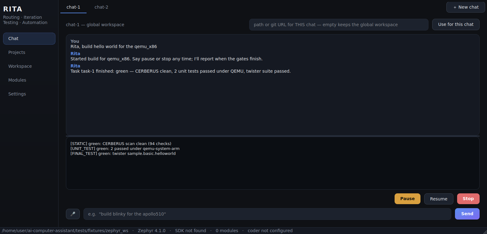
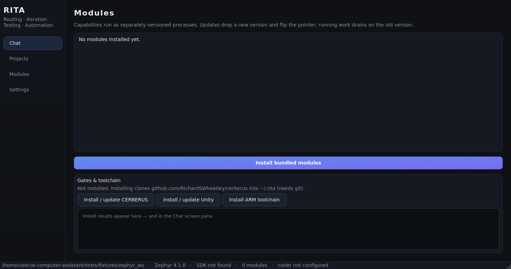
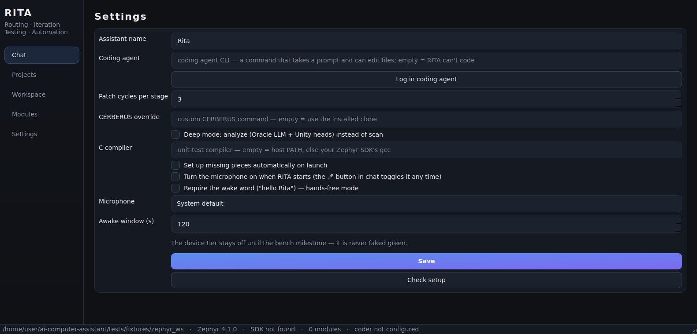

# RITA — Routing, Iteration, Testing, Automation

A **deterministic orchestrator** with a speech front end that drives
firmware development on a **Zephyr workspace** — and learns your
machine instead of assuming it. Formerly AICA; see
[`BRIEF.md`](BRIEF.md) for the reframe and
[`docs/WORKING-RULES.md`](docs/WORKING-RULES.md) for the working rules
every change follows.



RITA is **not an LLM agent**. The coding agent (any CLI you configure)
is one capability among several — it writes applications, tests, and
patches, investigates the machine, and builds toolsets when asked. It
does not route, does not decide when tests run, and does not judge its
own success:

- **Routing is grammar, not guessing.** A pure, table-driven router over
  RITA's own vocabulary (work verbs, board names from `boards.json`,
  samples, peripherals). Anything naming a board, sample, or artifact is
  work; chat is the fallback. Wake with "hello Rita" (the name is config,
  renameable by voice).
- **Launching RITA IS the setup.** On every launch she detects what's
  missing — CERBERUS, Unity, the ARM toolchain matched to *your* Zephyr
  SDK's gcc, her modules, the workspace sync — and installs it herself,
  visibly. Only picking the workspace and logging in your coding agent
  stay human.
- **She learns the system at runtime.** Sync is a learning pass:
  whatever her own detection can't see, the coding agent investigates
  (reading the machine, searching online), and **RITA validates every
  claim herself** before remembering it under `~/.rita/knowledge/`.
  Ask *"what did you learn"* any time.
- **Gates own verification.** CERBERUS static checks, per-function Unity
  tests compiled with `arm-none-eabi-gcc` and run under QEMU, then
  `west twister` — `twister.json` is parsed, stdout is never scraped.
  Bounded patch budgets; exhaustion is a reported outcome. The device
  tier stays **blocked on the bench milestone** and is never faked green.
- **Chats are tabs, each with its own workspace.** Open several chats
  at once; bind any of them to its own repo or a git URL right in the
  tab. Replies and build reports land in the chat that started them.
- **Toolsets: the agent builds tools RITA keeps.** *"Make a toolset
  that …"* — she has the agent write it, test-runs it before
  registering, and reruns it from disk forever after. Reuse is
  automation.
- **Voice lives in the app.** Pick your microphone in Settings; a
  silence gate keeps room noise away from the transcriber; an awake
  window sends her back to sleep so the television never becomes a
  command.
- **PAUSE / RESUME / STOP** at safe checkpoints, with pausable
  sentence-chunked speech, and **two output channels** — speech stays
  short; code, diffs, logs, and reports go to the screen pane.

## Quick start

**RITA is a desktop app** — see **[docs/GETTING-STARTED.md](docs/GETTING-STARTED.md)**
for the installer, first-run self-setup, and workflow examples.
Developers can run everything from a checkout:

```bash
pip install -e ".[dev,gui]"
rita-app                                       # the GUI (or: python -m rita.gui)
rita sync --workspace /path/to/zephyrproject   # index boards + samples/tests
rita check                                     # diagnose the whole setup
rita talk                                      # voice-only shell
rita mcp-serve --workspace ...                 # workspace MCP (needs .[mcp])
```

The suite runs headless with zero required dependencies — every external
process (`west`, twister, the coder command, MCP) sits behind a seam with
fakes and fixtures. Real builds need a Zephyr workspace + toolchain on
your machine (RITA installs the toolchain herself).

## The pipeline

```
utterance ── WakeGate ── route() ──► work ──► RESOLVE ─► STATIC ──► BUILD ─► UNIT ──► SIM_TEST ─► DEVICE
                            │                (find-or-  (CERBERUS)  (west)  (Unity/    (twister    (blocked on
                            └► chat/control   write)                         QEMU)      ≤3)         bench)
```

## Screenshots

| Modules & gates | Settings |
|---|---|
|  |  |

The pictures are real offscreen renders of the app
(`python packaging/screenshots.py` regenerates them).

## Documentation

| Doc | What's in it |
|---|---|
| **[Getting started](docs/GETTING-STARTED.md)** | Install, first-run self-setup, talking to RITA, troubleshooting |
| **[BRIEF.md](BRIEF.md)** | What RITA is and the order of work |
| **[Specs](docs/specs/)** | One spec per capability, with acceptance criteria |
| **[Working rules](docs/WORKING-RULES.md)** | Spec first, tests first, verify the artifact — the process every change follows |
| **[Sections](docs/SECTIONS.md)** | The modular map: each section's quality bar and deep-pass plan, worked one at a time |
| **[Decisions log](docs/DECISIONS-LOG.md)** | Every compromise, on the record |
| **[CHANGELOG.md](CHANGELOG.md)** | Versioned history |

Legacy design docs (desktop-assistant heritage, still reachable via
`rita run`): [architecture](docs/ARCHITECTURE.md),
[security](docs/SECURITY.md), [modes](docs/MODES.md),
[modularity](docs/MODULARITY.md), [worker protocol](docs/WORKER-PROTOCOL.md),
[business capabilities](docs/BUSINESS-CAPABILITIES.md),
[tech stack](docs/TECH-STACK.md), [roadmap](docs/ROADMAP.md).

## CLI

| Command | What it does |
|---|---|
| `rita talk` | Voice shell: wake word, grammar routing, managed tasks |
| `rita sync --workspace P` | Build `~/.rita/boards.json` + the verification index |
| `rita check [--deep]` | Diagnose the whole setup (deep = live agent test) |
| `rita toolchain install` | Fetch the ARM toolchain matching your SDK's gcc |
| `rita mcp-serve` | Serve the workspace MCP server over stdio |
| `rita modules [install --dev]` | List / install capability modules |
| `rita run "<goal>"` | Legacy desktop agent loop (screen + input control) |
| `rita doctor` / `plugins` / `doc` / `workflow` | Diagnostics, tools, docs, workflows |

Data and config live in `~/.rita/` (a legacy `~/.aica/` is migrated
automatically). The assistant's spoken name defaults to "Rita" and is
changeable by voice — it's config, not code.
